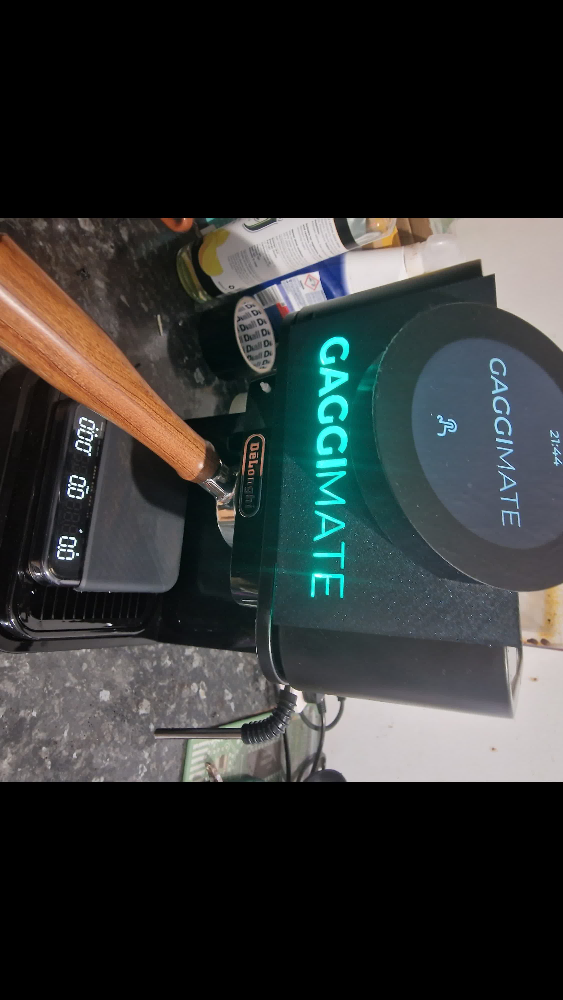

# GaggiMate

This repository contains 3D printable files for my espresso machine builds.

## GaggiMate

- **DIN Rail**: Mount the GaggiMate board to a DIN rail for easy clipping on and off the espresso machine.

## De'Longhi Stilosa EC230

- **Display Assembly**: SCAD file for display assembly. I didn't use this in the end, I used the StilosaLid
- **StilosaLid & FrontPanel** As seen in the picture here.
- **PushFit Clip**: 3MF and STL files for push-fit clips.

## License

This project is licensed under the MIT License - see the [LICENSE](LICENSE) file for details.
